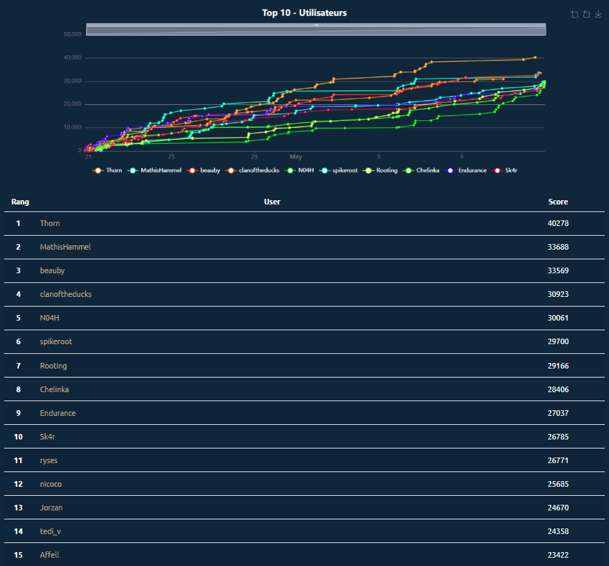

# 404CTF-2024 Writeups

This repository contains detailed explanations and solutions for some of the challenges I encountered during the competition.

## About 404CTF 2024

The 404CTF 2024 is an exciting yearly Capture The Flag event. This edition took place from April 20, 2024, to May 12, 2024. I thoroughly enjoyed the diverse and challenging problems presented throughout the event.

## My Performance

I am pleased to share that I finished in 14th place. The experience was both challenging and educational. Below is an image of the top 15 users in the final scoreboard.

## Writeups

Here are the writeups for some the challenges I solved during the CTF. Each writeup includes a detailed explanation of the problem and the steps I took to solve it.

1. [Challenge 1](writeups/challenge1.md)
2. [Challenge 2](writeups/challenge2.md)
3. [Challenge 3](writeups/challenge3.md)
4. ...
