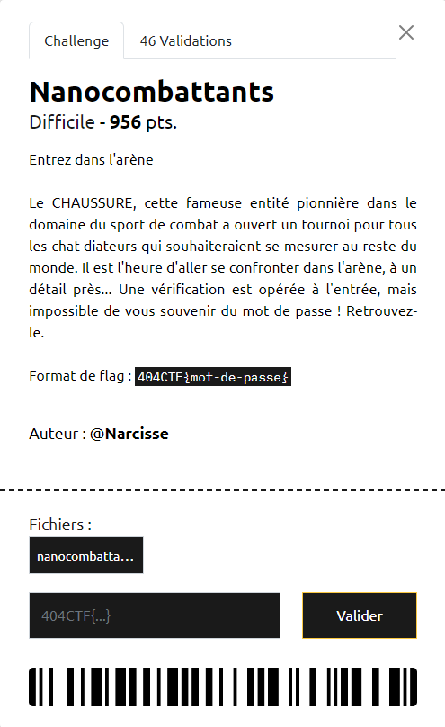
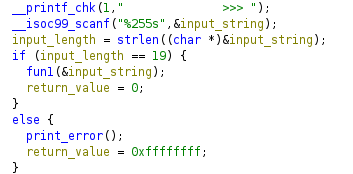
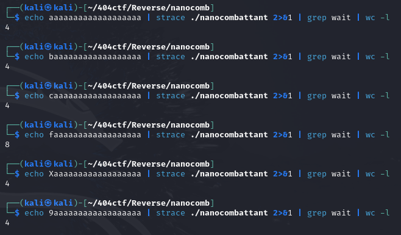
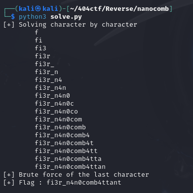

# Nanocombattants
**Category** : Reverse Engineering

**Difficulty** : Hard

**Solves** : 46

**Author**: @Narcisse

**File**: [nanocombattants](./nanocombattants)



## Description
In this challenge we are presented with a 64-bit ELF binary. The name of the challenge suggests we will be dealing with nanomites.

Nanomites are a protection mechanism involving two processes, where the parent monitors and controls the child. This setup ensures the child process cannot function without the parent, creating a strong interdependence that complicates debugging the binary. The child process can signal the parent using signals (usually SIGTRAP), while the parent process uses a function such as ```waitpid``` while waiting for the child's signal.

My way of solving this challenge does not revolve around reversing the binary, but instead using the binary's implementation of nanomites in order to perform a brute force attack of the password.

This part of the pseudocode generated by Ghidra gives us an important hint:



The password has a length of 19 characters. Analyzing the flow of the binary, we find that each character is being verified one by one, and that for each character there are multiple child processes created during the verification. The last part is crucial: the correct character will go the furthest in the program's execution, thus creating more child processes, and in turn have more ```wait``` system calls which can be picked up by the tool strace.




We can use this property of the binary to guess the password character by character in the [solve.py](./solve.py) script.



Which gives us the flag:
```404CTF{fi3r_n4n0comb4ttant}```

*If you want to learn more about nanomites, read [this article](https://doar-e.github.io/blog/2014/10/11/taiming-a-wild-nanomite-protected-mips-binary-with-symbolic-execution-no-such-crackme/#nanomites-101).*