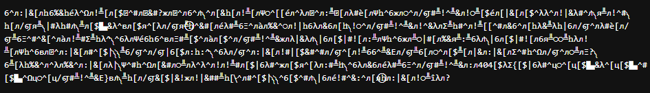
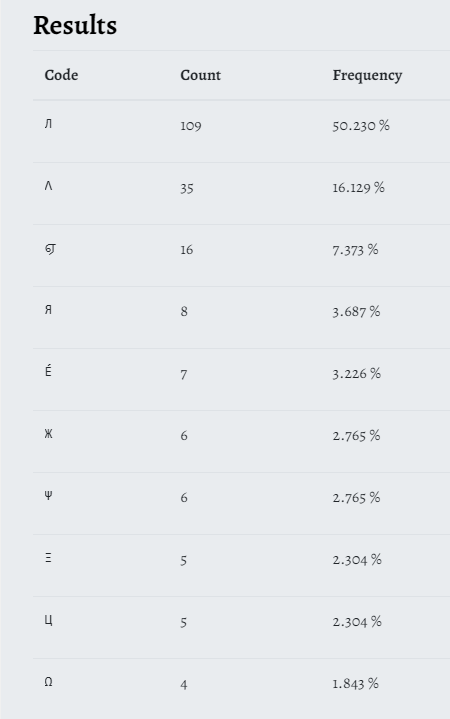

# La chute
**Category** : Steganography

**Difficulty** : Medium

**Solves** : 56

**Author**: @Crevette et Ceriseuh    

**File**: [charabia.txt](./charabia.txt)

## Description
We are presented with a text file which at first appears to be filled with gibberish and weird characters.



## Solve

My first instinct was some sort of weird encoding, or multiple encodings chained together, but after a few rabbit holes, i decided to count the frequency of each character. Most websites had a difficult time counting the unusual characters, but this one did the trick: [boxentriq](https://www.boxentriq.com/code-breaking/frequency-analysis)



We can tell that the characters do indeed follow a pattern you would expect from language frequency analysis, except for the character "л" which made up over half of the text. After giving it some thought, I concluded that "л" was in fact the substitution of a space character, and that this whole challenge was a substitution cipher. I also assumed that every character likely corresponds to one letter of the charset, since if the substitution was not deterministic, there would not be a character with such a high frequency as "л". (These are mostly my assumptions more than facts, but they did turn out to be correct.)

An assumption of mine that did turn out to be false, is that one character of the alphabet does not necessarily correspond to a single character of the substitution cipher. This was later made clear to me when I saw this part of the ciphertext:
``` 404[$λΣ{ ```

We can tell that the digits 4 and 0 and the special character '{' are not substituted, however between '404' and '{' there are four characters.
The flag format being ```404CTF{...}```, this means that there could be characters of the alphabet that correspond to two characters of the substitution cipher. Since the couple '[\$' was the most prevalent one in the ciphertext compared to '$λ' and 'λΣ' , I assumed it was the substitution for the letter 'c'.

From the previous image and a table of the French language's frequency analysis, '^' had a high likelihood of being the letter 'e'.


And so, I decided to substitute characters one by one with some trial and error, taking into account the fact that there could be two-character substitutions.
In the [solve.py](./solve.py) script you can find each step of the way and my line of reasoning. Also, one of the special characters ('ц') only occurred between the curly braces. Considering most of the flags during the competition contained underscores, I assumed it was the substitution for it.

Here is the deciphered text:


Giving us the flag:

```404ctf{contre_les_chutes_cherchez_les_drapeaux}```